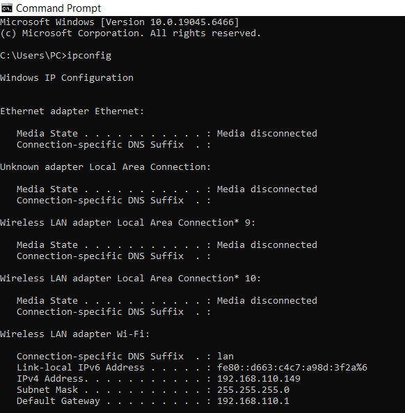
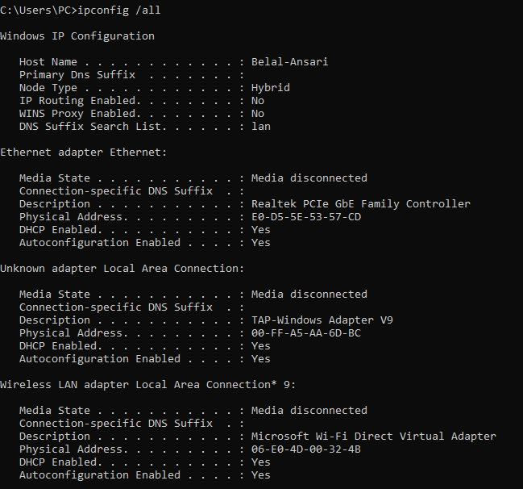
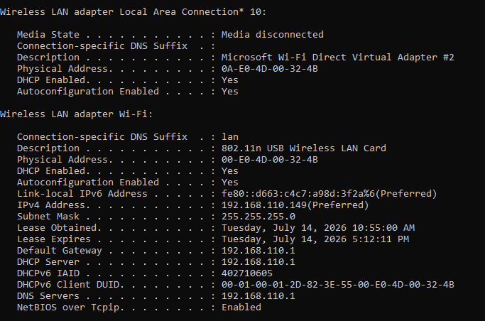
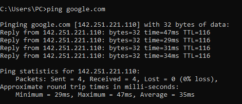
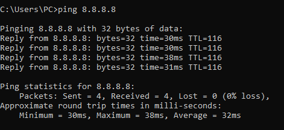
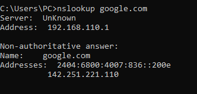
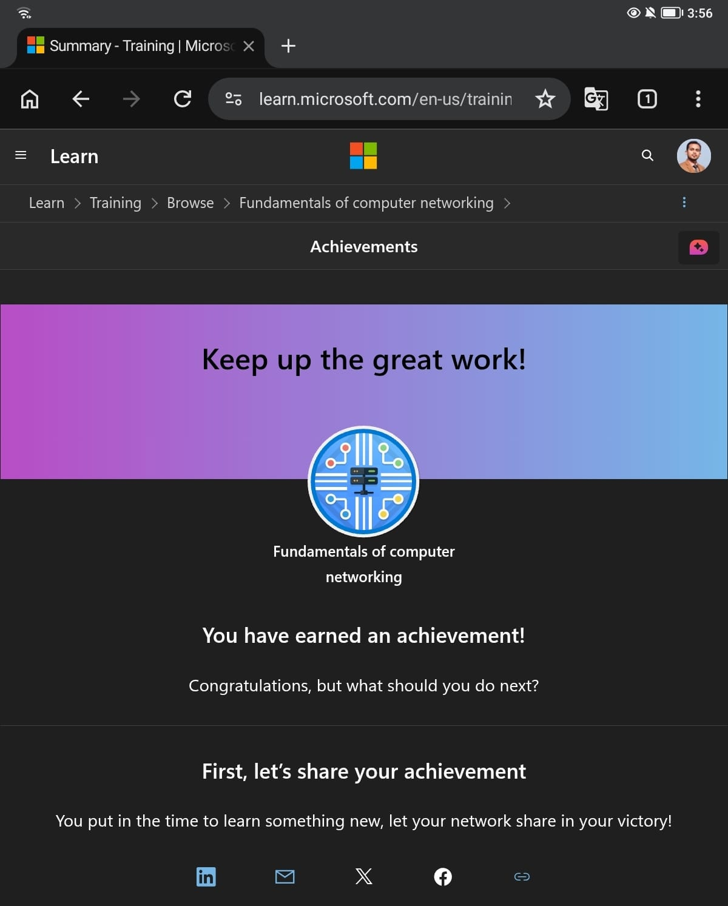

# Day 01 - Networking Fundamentals

## Objective

The objective of this lab was to understand the fundamental concepts of computer networking and become familiar with essential networking tools available in Windows.

---

## Topics Covered

- Internet
- IP Address
- IPv4
- IPv6
- Public IP Address
- Private IP Address
- MAC Address
- DNS
- Default Gateway
- Subnet Mask

---

## Commands Practiced

### ipconfig

Displays the current IP configuration.

```cmd
ipconfig
```

---

### ipconfig /all

Displays detailed network adapter information.

```cmd
ipconfig /all
```

---

### ping google.com

Tests Internet connectivity using a domain name.

```cmd
ping google.com
```

---

### ping 8.8.8.8

Tests Internet connectivity directly using Google's public DNS server.

```cmd
ping 8.8.8.8
```

---

### nslookup google.com

Queries the DNS server to resolve a domain name into an IP address.

```cmd
nslookup google.com
```

---

## Lab Outcome

During this lab I successfully:

- Identified my local IPv4 address
- Identified my default gateway
- Understood the difference between public and private IP addresses
- Tested Internet connectivity
- Verified DNS name resolution
- Learned how Windows displays network configuration

---

## Skills Learned

- Windows Networking
- Basic TCP/IP
- DNS Resolution
- Command Prompt
- Network Troubleshooting

---

## Screenshots

### ipconfig



---

### ipconfig /all





---

### Ping Google



---

### Ping 8.8.8.8



---

### nslookup



---

### Microsoft Learn Achievement


