# Day 02 - OSI & TCP/IP Fundamentals

## Objective

The objective of this lab was to understand the OSI Model, TCP/IP Model, and practice essential Windows networking commands commonly used by SOC Analysts during network troubleshooting and incident investigation.

---

# Topics Covered

- OSI Model
- TCP/IP Model
- TCP vs UDP
- Windows Networking Commands
- Active Network Connections
- Running Processes
- Windows Services
- ARP Table
- Routing Table
- MAC Address
- Traceroute
- PathPing

---

# Commands Practiced

## netstat -ano

Displays active TCP/UDP connections, listening ports, connection states, and associated Process IDs (PID).

```cmd
netstat -ano
```

---

## tasklist

Displays all currently running processes.

```cmd
tasklist
```

---

## tasklist /svc

Displays running processes together with Windows Services.

```cmd
tasklist /svc
```

---

## tasklist | findstr

Searches for a specific process using PID.

```cmd
tasklist | findstr 1780
```

---

## arp -a

Displays the ARP cache.

```cmd
arp -a
```

---

## hostname

Displays the computer hostname.

```cmd
hostname
```

---

## whoami

Displays the currently logged-in Windows user.

```cmd
whoami
```

---

## tracert

Shows the network path to a destination.

```cmd
tracert google.com
```

---

## pathping

Performs route tracing and packet loss analysis.

```cmd
pathping google.com
```

---

## route print

Displays the Windows routing table.

```cmd
route print
```

---

## getmac /v

Displays network adapters and MAC addresses.

```cmd
getmac /v
```

---

# SOC Analyst Notes

- **netstat** helps identify suspicious outbound connections.
- **tasklist** lists all active processes.
- **tasklist /svc** maps Windows services to processes.
- **arp** displays IP-to-MAC address mappings.
- **hostname** identifies the endpoint.
- **whoami** identifies the logged-in user.
- **tracert** analyzes packet routing.
- **pathping** identifies packet loss across network hops.
- **route print** displays Windows routing decisions.
- **getmac** identifies physical network adapters.

---

# Skills Practiced

- OSI Model
- TCP/IP
- Windows Networking
- Command Line
- Network Troubleshooting
- Basic Incident Investigation
- SOC Analyst Fundamentals

---

# Lab Evidence

## netstat -ano

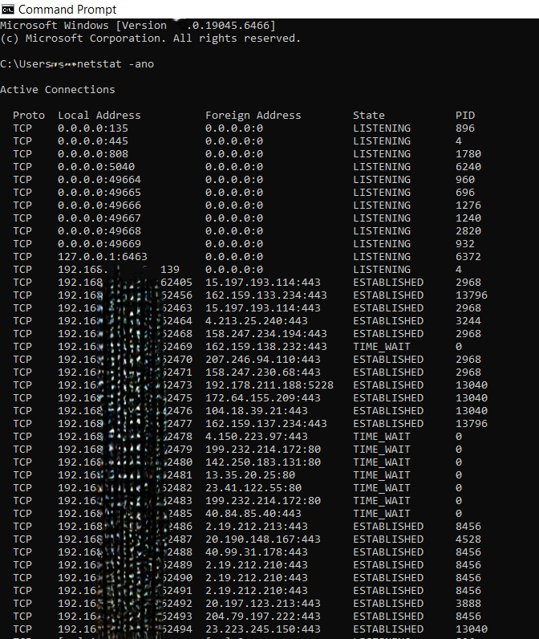

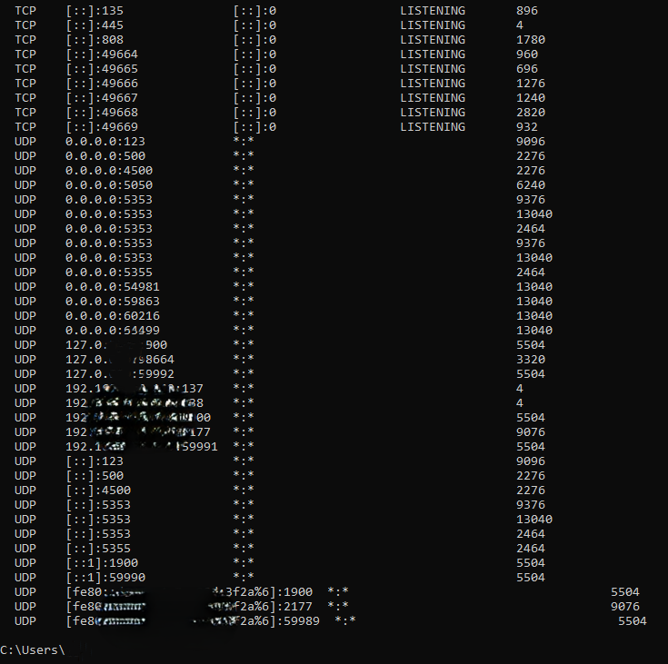

---

## tasklist /svc

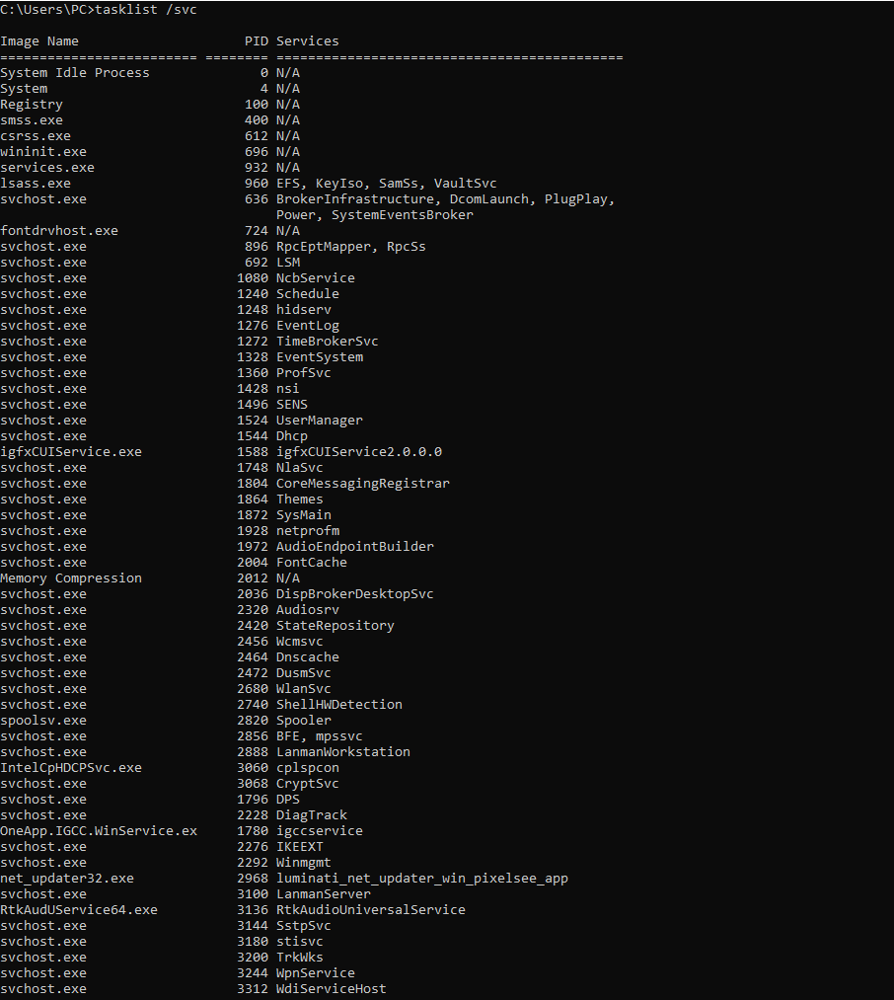

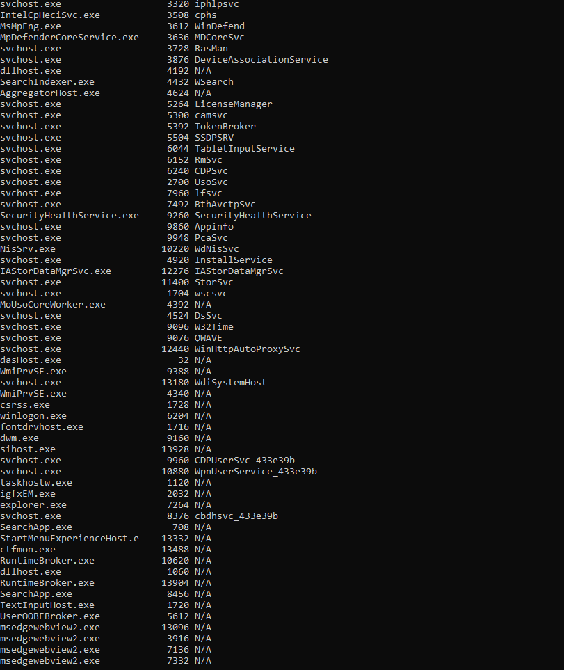

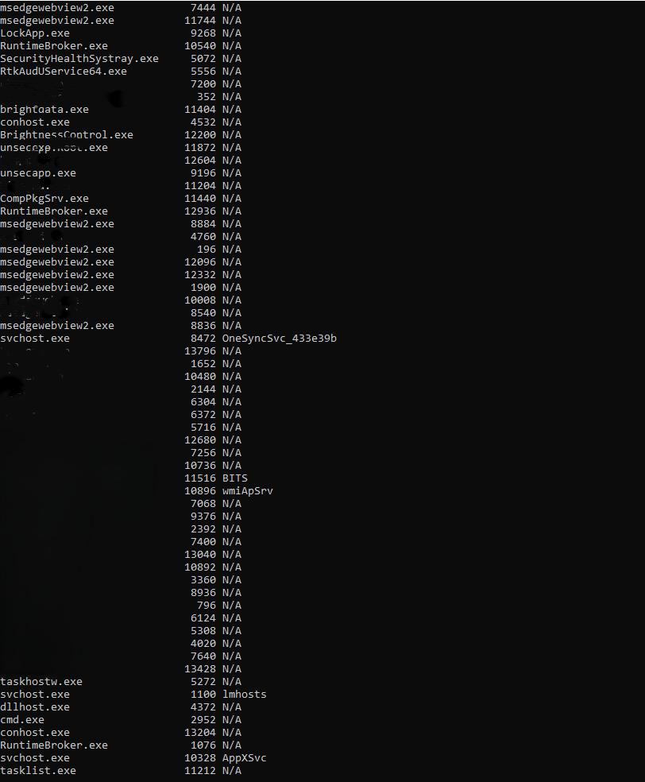

---

## tasklist | findstr

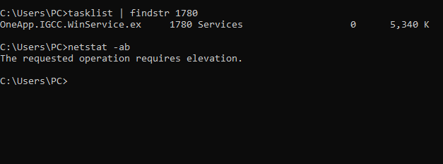

---

## ARP Table

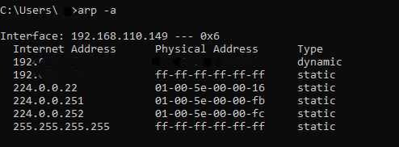

---

## Hostname, Whoami & Tracert

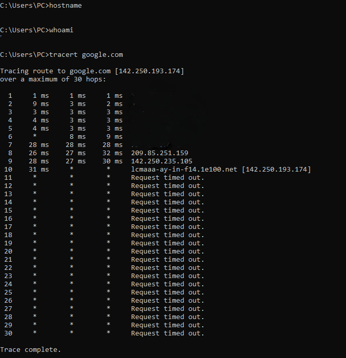

---

## PathPing

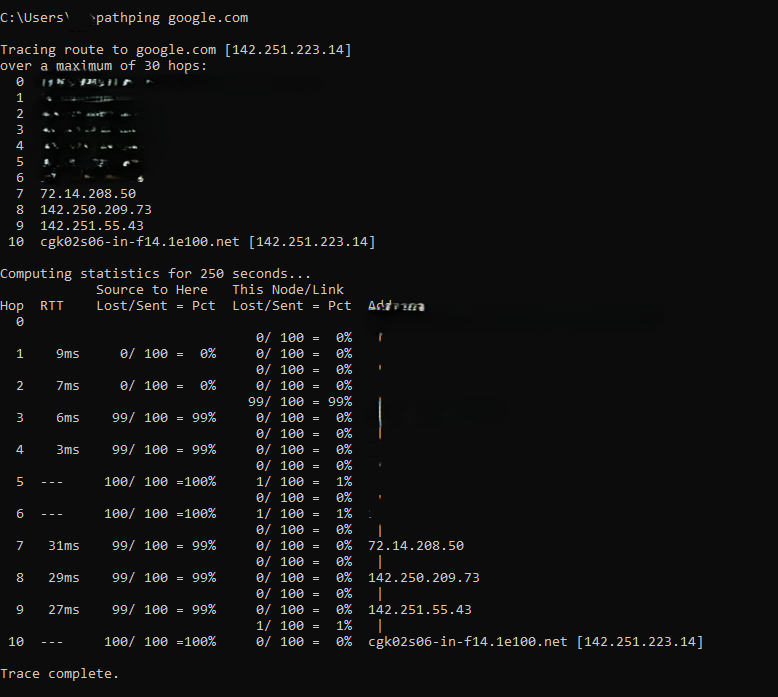

---

## Route Print

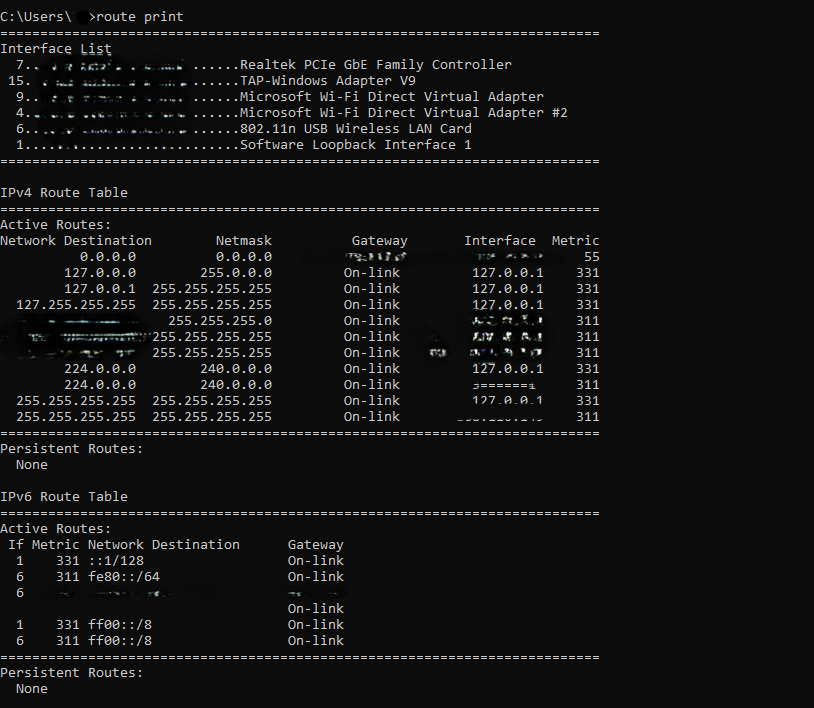

---

## GetMAC

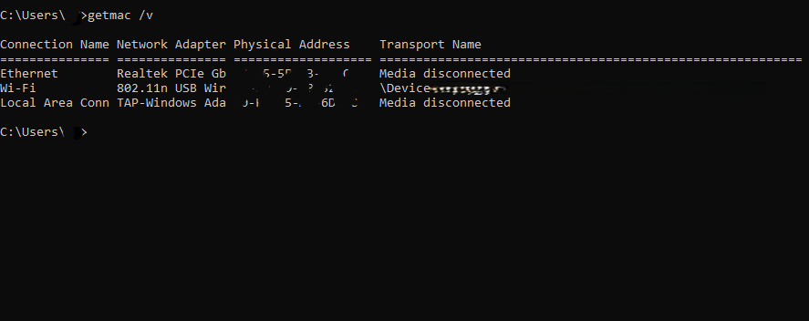

---

# Conclusion

Today I learned the OSI Model, TCP/IP fundamentals, and practiced essential Windows networking commands used by SOC Analysts to analyze network connections, processes, routing, and endpoint information.

This hands-on lab strengthened my understanding of Windows networking and command-line investigation techniques.
